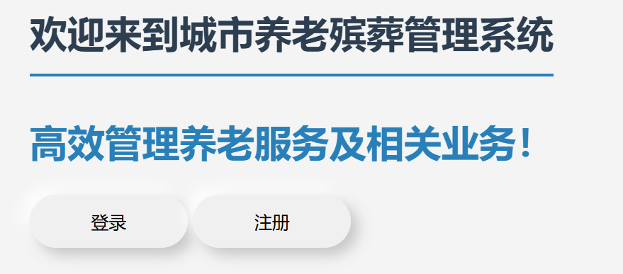
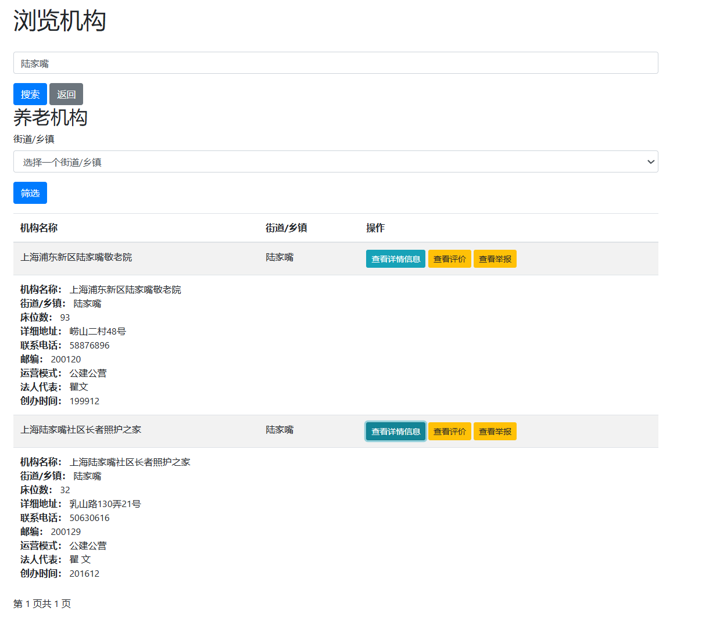
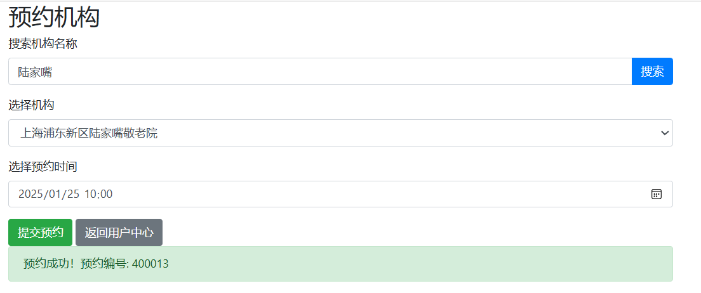

# 城市养老殡葬管理系统

## 项目简介

城市养老殡葬管理系统旨在通过信息化手段提升养老和殡葬服务的管理效率和透明度，方便老年人及其家属选择服务，帮助机构优化管理，并为政府部门提供监督支持。

## 项目功能

- **机构信息查询**：提供城市内400+养老机构和100+殡葬服务机构的详细信息（如地址、电话、服务内容等）。
- **健康数据监控**：实时反馈老年人的心率数据，并在异常情况下及时通知家属或相关人员。
- **评价与反馈**：用户可上传对机构的评价与评分，帮助机构改进服务质量。
- **举报与监管**：支持用户上传举报信息，供政府部门实时监控机构运营状况。
- **预约访问**：支持用户在线预约机构实地访问，提供方便快捷的服务体验。

## 技术栈

**前端**：

- `HTML` + `CSS` + `JavaScript`：实现页面展示和用户交互。

**后端**：

- `Python` + `Flask`：实现服务端逻辑与API接口。
- `MySQL`：存储机构信息、用户评价和健康数据。

**数据来源**：

- [上海市公共数据开放平台](https://data.sh.gov.cn/)，包含养老院和殡葬服务机构的详细信息。
    - **养老机构信息**：包含服务内容、收费标准、地理位置等详细信息。
    - **殡葬服务信息**：包括服务价格、业务范围、联系方式等。

## 系统架构

```plaintext
	用户 
	↕️ 
	前端（HTML, CSS, JavaScript） 
	↕️ 
	后端（Flask, Python） 
	↕️ 
	数据库（MySQL）
```

## 项目亮点
- **公共数据利用**：采用政府开放数据，保证信息的真实性与权威性。
- **专项数据整合**：集合养老机构和殡葬服务机构的详细数据，避免用户面对碎片化的信息而无从下手。
- **用户友好设计**：界面直观易用，支持多种功能模块的快速切换。
- **线上预约**：足不出户使用、处理预约服务，方便各类用户的使用。
- **监管支持**：为政府部门提供数据支持，协助实现行业规范化。

## 快速开始
### 环境配置
1. 克隆项目
```bash
https://github.com/hoshigawarei/Pension_Management.git
```
2. 安装依赖
- Python 3.x
- MySQL 5.7 或以上
- Flask
- 其他依赖库：
```bash
pip install -r requirements.txt
```
3. 数据库初始化
- 修改`db_cinfig.py`中的数据库配置信息
```python
# db_config.py
DB_CONFIG = {      
    'host': 'localhost',                   
    'port': 3306,                
    'user': 'xxx',                  # 修改为MySQL 用户名
    'password': 'xxx',               # 修改为MySQL 密码
    'database': 'pension_management'
}
```
- 建立数据库`pension_managment`
```bash
python create_db.py
```
- 创建表
```bash
python create_table.py
```
- 插入数据
```bash
python insert_data.py
```
4. 运行项目
```bash
flask run
```
5. 访问系统
打开浏览器，访问http://127.0.0.1:5000

## 演示视频
点击以下链接查看系统的功能演示视频：

🎥[演示视频链接](https://drive.google.com/file/d/1cukBOf59Ge345Yo0OBCgQQ2hnKTGoezm/view?usp=drive_link)

## 开发文档
项目的完整开发文档位于 `/doc` 文件夹。文档内容包括但不限于：
- 可行性分析
- 需求分析
- 总体设计
- 详细设计
- 性能测试

## 系统部分功能截图
- 首页


- 机构浏览、查询


- 机构预约


- 健康监控


## 未来计划
- 增加地图定位功能，帮助用户快速找到附近的养老或殡葬机构。
- 开发微信小程序，提升使用便利性。
- 引入AI推荐系统，基于用户需求推荐合适的机构。

## 贡献指南
欢迎贡献代码、优化功能或提出建议：

1. Fork 本仓库
2. 创建新分支：`git checkout -b feature/功能描述`
3. 提交更改：`git commit -m 'Add 新功能'`
4. 推送分支：`git push origin feature/功能描述`
5. 提交 Pull Request

### 联系方式

如有任何问题，请联系：
`xiao-yuwang@outlook.com`
